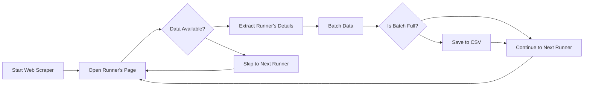

# Web-Scrape-Multiple-pages
## Overview

This project is a scraper tool for extracting individual runner details from the `https://resultater.cphhalf.dk` website, particularly focusing on the runners of the CPH Half Marathon. The script captures details like the name, starting number, nation, team, gender, age group, total time, various split times, and more.

The results are batched and saved into a CSV file for further analysis or reporting. Check 'runners_data.csv'.

## Prerequisites

Before running the scraper, ensure you have the following:

- Python (tested with version 3.x)
- Selenium WebDriver (Tested using the Firefox driver)
- pandas

You can install the necessary libraries using pip:
```bash
pip install selenium pandas

```
Also, make sure you have the geckodriver (for Firefox) installed and accessible in your PATH for Selenium to function properly.

## How to Run

1. **Clone the Repository**: Clone the repository from GitHub to your local machine.
   
   ```bash
   git clone https://github.com/Mathias2860DK/Web-Scrape-Multiple-pages.git 
   ```


2. **Run the script**: Run this script using Python (Make sure you are inside the folder)
  ```bash
   python scrape.py
   ```

## Features

- **Robust Data Collection**: Extracts a plethora of details from the website, including the runner's name, starting number, nation, gender, age group, total time, distance, average pace, overall placement, gender placement, class placement, and even split times.

- **Intelligent Batching**: Data is batched and saved at regular intervals, ensuring minimal loss in case of interruptions.

- **Exception Handling**: The script gracefully handles unexpected elements, missing data, and unforeseen errors to ensure maximum data extraction.

## UML diagrams

**Flow chart** showing how the web scraper works (roughly)


